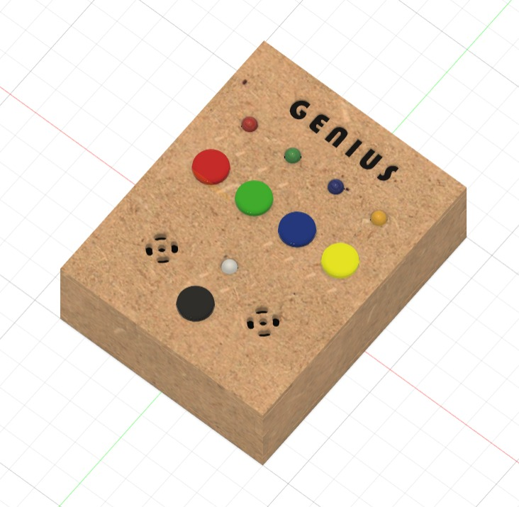
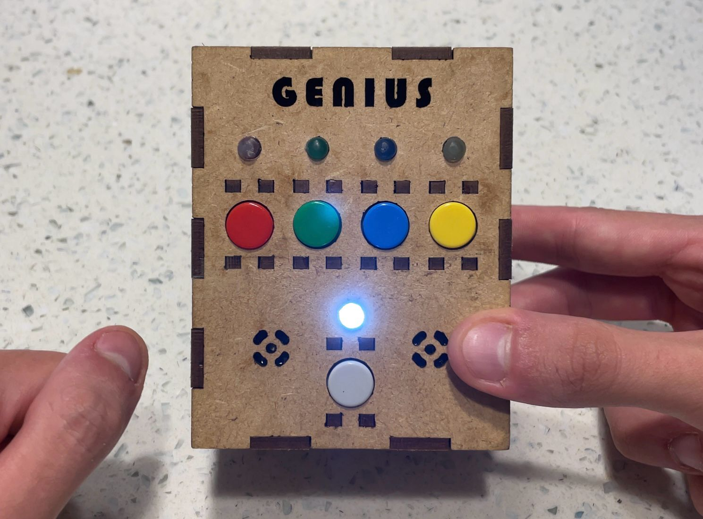

# GENIUS GAME #

**Grupo:** Lucas Lima e Luiz Eduardo Pini

[Vídeo de demonstrção](https://youtu.be/H6hJxIV87x4)

  
  

  

## Descrição do projeto
O jogo Genius é um jogo eletrônico clássico de memória e sequência. Ele desafia os jogadores a lembrar e reproduzir sequências de luzes, sons ou cores em uma ordem específica. O jogo é composto por um dispositivo eletrônico com botões ou cores que acendem e emitem sons.

A jogabilidade geralmente consiste em uma série de rodadas, onde o jogo mostra uma sequência de cores, sons ou botões que os jogadores devem lembrar e repetir na mesma ordem. Cada vez que o jogador reproduz corretamente a sequência, ela se torna mais longa e desafiadora.

Se o jogador cometer um erro ao repetir a sequência, o jogo pode emitir um som de erro ou luzes piscando para indicar o erro, e o jogador pode ter que começar de novo ou perder uma vida, dependendo das regras do jogo.

O objetivo do jogo Genius é testar e melhorar a memória e a capacidade de concentração dos jogadores, desafiando-os a lembrar e reproduzir sequências cada vez mais longas e complexas. É um jogo divertido e desafiador que tem sido apreciado por pessoas de todas as idades desde sua introdução nos anos 1980.

O projeto foi feito utilizando a Raspberry Pico e programado em C, usando interrupções que a placa oferece.